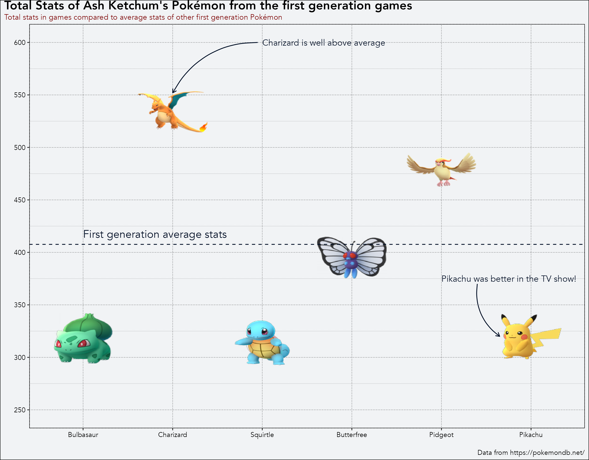
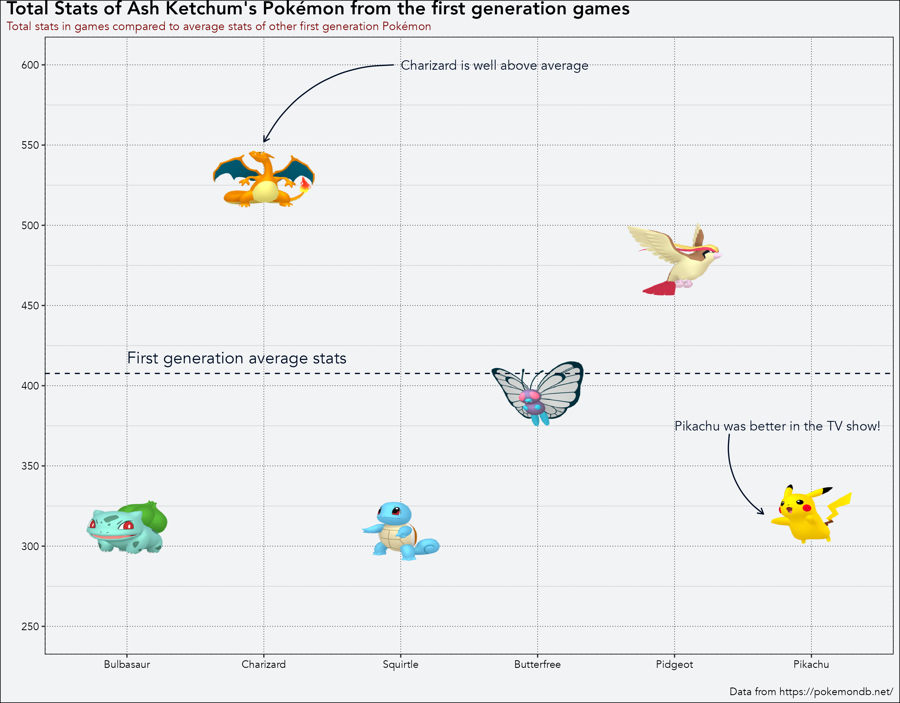
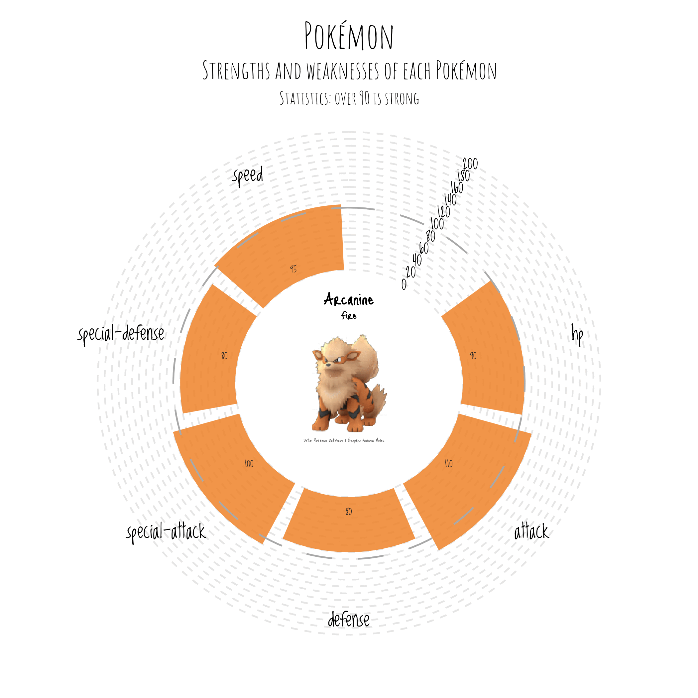

# Pokemon_viz
[Fun visualisations of data from the Pokémon games!](https://andrewmoles2.github.io/Pokemon_viz/)

We can look at how Ash Ketchum team from the Pokémon tv show stands up in the Pokémon games. Two different versions here. The first uses geom_pokemon from ggimage. The second uses images scraped from the pokemon database website. 

Another idea is to look at the statistics of the Pokémon on an individual level. These visualisations are a little more *arty*. End goal is to turn this into a interactive application, where someone can select a Pokémon they like, and see their statistics. 

The data for these visualisations was scraped from the [Pokémon database website](https://pokemondb.net/). The code used to scrape the data can be found [elsewhere](https://github.com/andrewmoles2/webScraping/tree/main/R) on my GitHub. 

